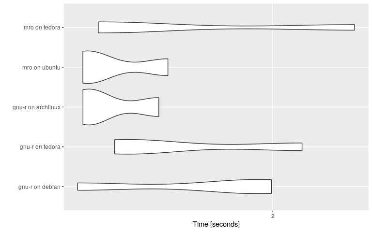

<!-- README.md is generated from README.Rmd. Please edit that file -->

# altRnative

<!-- badges: start -->

[](https://www.tidyverse.org/lifecycle/#experimental)
[](https://travis-ci.org/ismailsunni/altRnative)
<!-- badges: end -->

An R package to run you R code in different R implementations and
platforms in [Docker]() containers.

## Installation

You can install the development version [from
GitHub](https://github.com/ismailsunni/altRnative) with:

``` r
# install.packages("remotes")
remotes::install_github("ismailsunni/altRnative")
```

## Example

``` r
library('altRnative')
pull_docker_image(c('gnu-r', 'mro'), c('debian', 'ubuntu', 'fedora'))
#> Detected API version '1.40' is above max version '1.39'; downgrading

benchmark_result = benchmarks_code(
  code = "1 + 1", 
  r_implementations = c('gnu-r', 'mro'), 
  platforms = c('debian', 'ubuntu', 'fedora', 'archlinux'),
  times = 3
  )
#> Detected API version '1.40' is above max version '1.39'; downgrading
#> Detected API version '1.40' is above max version '1.39'; downgrading
#> Detected API version '1.40' is above max version '1.39'; downgrading
#> Detected API version '1.40' is above max version '1.39'; downgrading
#> Detected API version '1.40' is above max version '1.39'; downgrading
#> Detected API version '1.40' is above max version '1.39'; downgrading
#> Detected API version '1.40' is above max version '1.39'; downgrading
#> Detected API version '1.40' is above max version '1.39'; downgrading
#> Detected API version '1.40' is above max version '1.39'; downgrading
#> Detected API version '1.40' is above max version '1.39'; downgrading
#> Detected API version '1.40' is above max version '1.39'; downgrading
#> Detected API version '1.40' is above max version '1.39'; downgrading
#> Detected API version '1.40' is above max version '1.39'; downgrading
#> Detected API version '1.40' is above max version '1.39'; downgrading
#> Detected API version '1.40' is above max version '1.39'; downgrading

library('ggplot2')
autoplot(benchmark_result)
#> Coordinate system already present. Adding new coordinate system, which will replace the existing one.
```



## Contribute

Please note that the ‘altRnative’ project is released with a
[Contributor Code of Conduct](CODE_OF_CONDUCT.md). By contributing to
this project, you agree to abide by its terms.

## License

This project is published under MIT license, see file `LICENSE`.
